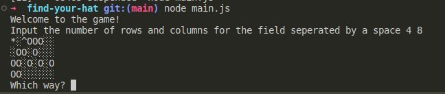

# Find Your Hat Game



## Introduction

The **Find Your Hat** game is an exciting text-based adventure where your goal is to find your lost hat in a vast field filled with holes and obstacles. Can you navigate your way to victory and locate your hat?

## How to Play

1. When the game starts, you will be asked to put in the dimensions of the grid representing the field. You will start at one location, and your lost hat will be hidden somewhere on the field.

2. Use the following commands to move around:
   - `u`: Move up
   - `d`: Move down
   - `r`: Move right
   - `l`: Move left

3. Your current position will be marked with `*`, empty spaces will be represented by `░`, holes by `O`, and your hat by `^`.

4. Avoid stepping into holes (O) or going out of bounds, or you'll lose the game.

5. Keep moving until you find your hat (^), and you win!

## Installation

1. Ensure you have Node.js installed on your computer.

2. Clone the game repository from [GitHub](https://github.com/dmimar382/find-your-hat.git).

3. Navigate to the project directory in your terminal.

4. Run the game by executing the following command:

   ```bash
   node main.js

## Features
 - Randomly generated fields for endless gameplay.
 - Interactive text-based gameplay.
 - Challenging obstacles and a hidden hat to find.

## Technologies Used
 - JavaScript
 - Node.js

## Contributors
 Maria Myers (@dmimar382)